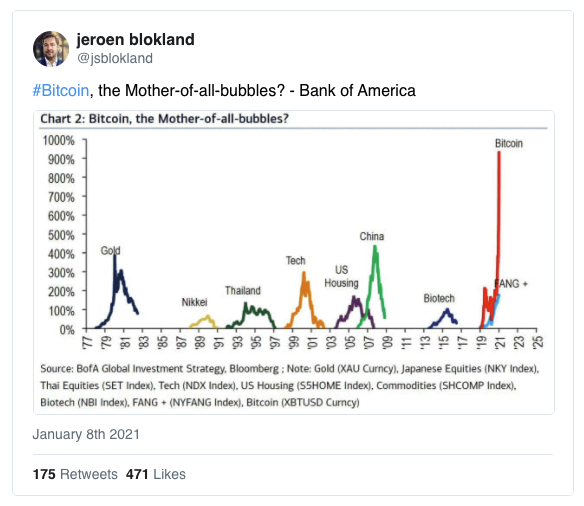

_Cet article fait partie de ma Newsletter "La Crypto Lettre". [Abonnez vous](https://cryptolettre.substack.com/) pour recevoir les prochaines éditions directement dans votre boite mail !_

Piratages, comptes off-shore au Panama, banques fantômes et complots pour manipuler le prix du Bitcoin : bienvenue dans le monde impitoyable des crypto-monnaies.

**Temps de lecture : 9 minutes.**

Chers investisseurs,

Depuis dimanche dernier le prix du Bitcoin a grandement fluctué, passant de 34 000 euros à 25 000 euros en 3 jours, avec notamment une baisse de 25% du prix en quelques heures, puis une remontée de 30% mercredi et jeudi.

Une telle variation serait impossible dans les marchés traditionnels, il existe des garde-fous pour éviter une panique généralisée. Le 12 mars 2020, quand le monde bascule dans l'ère du coronavirus, les marchés américains dévissent de 7% et les systèmes de sécurité bloquent tout achat ou vente pendant 15 minutes pour laisser le temps aux opérateurs de reprendre leurs esprits et ne pas céder à la panique. Ces systèmes n'existent pas sur les marchés des crypto-monnaies.

D'ailleurs, si nous comparons la situation actuelle à celle du pic du Bitcoin en 2017, de nombreuses chutes étaient survenues avant d'arriver à l'apogée. J'ai mis en évidence ici les plus significatives.

Une variation d'ampleur comparable, de -12 à -31 %, s'était déjà produite à trois reprises en fin d'année 2017, en septembre, novembre et décembre.

text: Avant le plus haut de 2017, une série de replis étaient survenus, dont 3 ici en rouge

Une baisse de 25% sur quelques jours n'a donc rien d'exceptionnel. Il convient aussi de noter qu'au final , le bitcoin est toujours en hausse de 300% sur l'année, (en rouge à droite : la chute de cette semaine).

Il est donc toujours indispensable de contextualiser les informations qui vous parviennent, en lisant [ma newsletter **La Crypto-Lettre**](https://cryptolettre.substack.com/) par exemple. 😬

J'ai pour ma part été protégé de la baisse grâce à un allègement progressif de mon portefeuille de crypto-monnaies. Non pas que j'avais prévu un repli comme celui de ce début de semaine mais j'aborde le mois de janvier sous le signe de la prudence car un évènement que j'attends depuis 2017 est en train de se produire.

Nous avons abordé dans [la newsletter précédente](https://cryptolettre.substack.com/p/1-bitcoin-le-nouvel-or-numrique) un lien éventuel entre les flux d'investissement sur l'or et ceux sur le Bitcoin, quand les flux d'argent en direction de l'or diminuent, ceux en direction du bitcoin remontent.

On peut aussi imaginer qu'un acteur malveillant du marché manipule le prix du Bitcoin pour son profit.

**Rentre en jeu le Tether.**

Le Tether est classé **3ème en terme de taille de marché** dans le monde des cryptomonnaies, après Bitcoin et Ethereum (dont nous parlerons dans une prochaine newsletter) et est souvent premier en volume journalier échangé.

Tether est une crypto-monnaie qualifiée de Stablecoin. **Un Stablecoin est une crypto-monnaie qui garde une valeur stable, ici 1 Tether = 1 Dollar américain.**

Dans un marché fondé en grande partie sur la spéculation, **Tether représente la sûreté, sa valeur ne change jamais.** Le Tether aide à fournir des liquidités, est largement reconnu, accepté par les acteurs du marché et permet de faciliter les transactions. C'est **un dollar numérique** dont le volume des transactions dépasse certains jours celui du Bitcoin...

Le cours du Bitcoin peut chuter de 25% en quelques heures comme cette semaine, accepter du Bitcoin ou une autre cryptomonnaie en paiement représente un risque fort, accepter du Tether vous protège contre la fluctuation violente des crypto-monnaies.

Le Tether est en quelque sorte le sésame pour entrer sur le marché de la crypto-monnaies. Il est particulièrement difficile pour les sites de trading de crypto-monnaies d'établir des relations commerciales avec des banques pour permettre aux utilisateurs d'alimenter leur compte de trading depuis leur compte en banque. Un très grand nombre d'entre eux reposent donc entièrement sur le Tether mais certains sites sérieux comme Coinbase et Bistamp ont pu convaincre le système bancaire d'ouvrir leurs portes grâce à des processus de KYC (Know Your Customer, vérification d'identité) et d'AML (Anti Money Laundering, anti-blanchiment d'argent) strictes.

La question à 24 milliards de dollars qui fait l'objet d'une enquête du procureur général de New York, c'est de savoir si **le rôle caché de Tether n'est pas simplement de manipuler le prix du Bitcoin et des crypto-monnaies**, qui, rappelons le, s'échangent sur des marchés non régulés.

Le Tether n'est pas une monnaie décentralisée comme le Bitcoin dont la gouvernance est partagée entre tous les acteurs du marché. **Tether est une entreprise**, Tether Limited fabrique, "imprime" et gère l'approvisionnement de Tether. Contrairement aux crypto-monnaies classiques, Tether Limited peut décider d'émettre autant de Tether qu'elle le souhaite. **L'entreprise bénéficie d'une relation particulière avec le site de trading de crypto-monnaies "Bitfinex", également dirigé par les fondateurs de Tether Limited, comme l'ont révélé les [Panama Papers](https://offshoreleaks.icij.org/nodes/82024464) (**une fuite de 12 millions de documents confidentiels en 2016 qui détaillent des informations confidentielles de 215 000 sociétés offshore)

Tether Limited prétend émettre des Tether en fonction des besoins. **Par exemple, je fais un virement bancaire de 1000 dollars à Tether, qui en échange me transfère 1000 Tether (appelés aussi USDT, pour United States Dollar Tether) sur un portefeuille de cryptomonnaies.** De nombreux détracteurs pensent néanmoins que ce n'est pas le cas et que Tether émet des USDT sans recevoir de dollars en contrepartie. Des avocats, des économistes, des chercheurs et plusieurs organes légaux américains se sont penchés sur le sujet et **accusent Tether de faire partie d'une arnaque d'une ampleur massive et élaborée qui consiste à imprimer des Tether pour acheter des Bitcoins**, ce qui a pour effet mécanique de pousser le prix vers le haut, puis de vendre ces Bitcoins contre des vrais dollars.

**Voila comment Tether est soupçonné de transformer des USDT en dollars :**

1. Les propriétaires de Tether impriment des millions (voir milliards d'USDT) sans aucun dollar reçu en contrepartie
2. Ils déposent ces millions d'USDT sur le site d'échange de crypto-monnaies complice Bitfinex (qu'ils possèdent également)
3. Les propriétaires de Bitfinex utilisent ces USDT pour acheter du Bitcoin et autre crypto-monnaies.
4. Les propriétaires de Bitfinex transfèrent ces crypto-monnaies sur d'autres sites de trading.
5. Sur ces sites de trading, ils vendent leurs crypto-monnaies contre des dollars, qu'ils transfèrent ensuite sur leurs comptes en banque.

Bien évidemment, Tether Limited refuse tout audit indépendant, il n'y a aucune transparence. Le "Journal Of Finance" et ses auteurs ont publié [une étude](https://onlinelibrary.wiley.com/doi/full/10.1111/jofi.12903) mettant en lumière ce mécanisme grâce au site de trading complaisant Bitfinex.

**On constate ci-dessus une nette corrélation entre le nombre de Tether en circulation (la ligne rouge) et le prix du bitcoin lors de son dernier pic en 2017 (la ligne bleue).** D'ailleurs, sur le dernier rebond de la ligne rouge tout a droite, qui correspond à une forte émission de Tether, on voit bien que le prix du Bitcoin est fortement remonté, avant de s'écraser de nouveau une fois que Tether arrête d'imprimer des USDT.

Lors de cet épisode de bulle il y a 3 ans, le prix du Bitcoin était passé de 1000 dollars à 10 000 puis 20 000 avant de s'écrouler plus tard à 2 700 dollars. Si on inclut les autres crypto-monnaies qui suivent les fluctuations du Bitcoin, c'est 450 milliards de dollars de valeur qui ont étés créés puis détruits en l'espace de quelques mois et 50% de la valeur du Bitcoin perdue en 5 jours en Décembre 2017.

Les moins avertis diront que c'est le cycle normal d'une bulle, personne ne sait ce que vaut vraiment le Bitcoin, mais quand les autres sont avides nous le sommes aussi, et quand les autres prennent peur nous avons peur aussi.

En Janvier 2021, nous sommes dans le même contexte : des émissions de Tether au plus haut historique avec un pic au delà de 2 milliards de dollars émis en quelques jours.

Si on regarde les flux d'argents entrants dans le Bitcoin, on constate que ce sont majoritairement des Tether qui sont utilisés pour les acheter.

Source - Coinlib BTC

**Le 21 Janvier 2021 marquera un virage dans le monde des cryptomonnaies**, le procureur général de l'état de New York, Letitia James, a exigé pour cette date la fourniture des documents de la part de Tether et du site de trading complice Bitfinex visant à expliquer certaines transactions frauduleuses suite à une investigation lancée en Novembre 2018.

Les deux entreprises sont étroitement liées et les résultats de cette investigation peuvent avoir l'effet d'une bombe dans le monde de la crypto-monnaie. On ne parle pas ici de quelques milliards de dollars : Tether est accusé dans [une class action](https://www.courtlistener.com/recap/gov.uscourts.nysd.524076/gov.uscourts.nysd.524076.1.0.pdf) datant de juin 2019 d'avoir causé au total 1,4 trilliard de dollars de pertes lors du pic puis du crash des cryptomonnaies en 2017, «la plus grande bulle de l'histoire de l'humanité».

Les relations Tether <> Bitcoin sont donc complexes mais méritent une attention particulière. On vient de démontrer qu'il existe **une forte corrélation entre les mouvements du Bitcoin et les impressions de Tether, ce qui peut nous permettre à nous aussi de jouer à la hausse comme à la baisse le prix du Bitcoin.**

**J'aborderai ces éléments dans une newsletter réservée aux abonnés payants, en attendant, accrochez vos ceintures, le mois de janvier sera mouvementé. 🎢**

Nous avons juste effleuré le sujet, digne d'un roman d'espionnage avec des banques fantômes enregistrées au Panama, des piratages non élucidés, des millions de Bitcoins qui disparaissent...

Voila pourquoi j'ai décidé de sécuriser mes fonds : si Tether s'écroule du fait de l'enquête en cours, **tous les sites de trading de crypto-monnaies pourraient devenir insolvables et bloquer les retraits, au moins temporairement.** Au même titre que l'argent qui est sur votre compte en banque pourrait disparaitre si la banque fermait soudainement, les transferts de crypto-monnaies sur les sites de trading pourraient être gelés si la situation se dégradait subitement. Je dirais aujourd'hui que la probabilité qu'un évènement comme cela se produise est très faible. Néanmoins je préfère protéger mon capital, quitte à rater quelques opportunités de trading pendant quelques semaines.

Enfin, à ceux qui pensent que Tether est trop gros pour s'écrouler, permettez-moi de vous rappeler le sort du site de trading [Liberty Reserve en 2013](https://www.lemonde.fr/economie/article/2013/05/29/l-affaire-liberty-reserve-revele-les-liens-entre-monnaies-virtuelles-et-criminalite_3420048_3234.html), qui était rentré dans le viseur de la justice américaine et qui avait été démantelé après une fraude estimée à 6 milliards de dollars.

---

**En bref cette semaine :**

- Bitcoin, serait "la mère de toute les bulles" (comprenez ici, la plus grosse jamais vue) d'après les analystes de Bank Of America. Ils ont comparé la hausse récente de la crypto-monnaie à des situations similaires où des bulles spéculatives ont éclaté, comme l'or dans les années 70 ou la bulle de l'internet dans les années 2000.

- L'instabilité récente n'empêche pas l'investisseur Tim Draper de prédire à son tour un Bitcoin à 250 000 dollars en 2022. Il avait acheté en 2014 30 000 Bitcoins. Un joli pactole déjà aujourd'hui.
- Christine Lagarde a confirmé cette semaine qu'il y aurait un euro numérique dans moins de 5 ans. L'euro n'est-il pas déjà numérique ? 🧐 Elle a également ajouté que le Bitcoin avait besoin d'être régulé. Une question très polémique dans le milieu.
- La police allemande a démantelé cette semaine le plus grand marché noir du darknet qui facilitait la vente de drogues, de cartes de crédits volées et de logiciels malveillants. Les 500 000 utilisateurs et les 2 400 fournisseurs utilisaient principalement le Bitcoin comme moyen de paiement.

A dimanche prochain,

Anton.

_Vous n'avez pas tout compris ? Pas de panique, [lisez les prochaines éditions](https://cryptolettre.substack.com/), en quelques semaines tout deviendra plus clair. J’ai abordé ici des sujets que je détaillerai bientôt. Vous avez une question, une remarque ? Laissez moi un commentaire ou envoyez moi un mail!_

### **_Attention : ceci ne constitue pas une incitation à l’achat ni un conseil personnalisé. Les performances passées ne préjugent pas des performances futures._**

Sources:

- [https://amycastor.com/2020/12/14/news-michael-saylor-buys-bitcoin-with-abandon-tether-reaches-20b-massmutual-jumps-on-btc-bandwagon/](https://amycastor.com/2020/12/14/news-michael-saylor-buys-bitcoin-with-abandon-tether-reaches-20b-massmutual-jumps-on-btc-bandwagon/)
- [https://www.barrons.com/news/german-police-take-down-world-s-largest-darknet-marketplace-01610449507](https://www.barrons.com/news/german-police-take-down-world-s-largest-darknet-marketplace-01610449507)
- [https://newrepublic.com/article/160905/tether-cryptocurrency-scam-enrich-bitcoin-investors](https://newrepublic.com/article/160905/tether-cryptocurrency-scam-enrich-bitcoin-investors)
- [https://crypto-anonymous-2021.medium.com/the-bit-short-inside-cryptos-doomsday-machine-f8dcf78a64d3](https://crypto-anonymous-2021.medium.com/the-bit-short-inside-cryptos-doomsday-machine-f8dcf78a64d3)
- [https://www.reddit.com/r/CryptoCurrency/comments/ksdfne/why_tether_might_tank_the_crypto_market_on_jan/](https://www.reddit.com/r/CryptoCurrency/comments/ksdfne/why_tether_might_tank_the_crypto_market_on_jan/)
- [https://danco.substack.com/p/the-trillion-dollar-lawsuit-part?token=eyJ1c2VyX2lkIjo2MTQwNiwicG9zdF9pZCI6MTYwNDE1LCJfIjoiR04vbWEiLCJpYXQiOjE1NzI4Mjk2NDksImV4cCI6MTU3MjgzMzI0OSwiaXNzIjoicHViLTg2MjMiLCJzdWIiOiJwb3N0LXJlYWN0aW9uIn0.LEnAhs6P88d7mEmzqAZmdP2O767cIwRI73guebuO6L4](https://danco.substack.com/p/the-trillion-dollar-lawsuit-part?token=eyJ1c2VyX2lkIjo2MTQwNiwicG9zdF9pZCI6MTYwNDE1LCJfIjoiR04vbWEiLCJpYXQiOjE1NzI4Mjk2NDksImV4cCI6MTU3MjgzMzI0OSwiaXNzIjoicHViLTg2MjMiLCJzdWIiOiJwb3N0LXJlYWN0aW9uIn0.LEnAhs6P88d7mEmzqAZmdP2O767cIwRI73guebuO6L4)
- [https://news.ycombinator.com/item?id=25683586](https://news.ycombinator.com/item?id=25683586)
- [https://fred.stlouisfed.org/series/M1](https://fred.stlouisfed.org/series/M1)[https://medium.com/hackernoon/what-will-happen-when-the-shit-hits-the-fan-with-tether-f59f92fd8dca](https://medium.com/hackernoon/what-will-happen-when-the-shit-hits-the-fan-with-tether-f59f92fd8dca)
- [https://twitter.com/TimDraper](https://twitter.com/TimDraper)
- [https://qz.com/1654449/is-tether-a-factor-in-bitcoins-price-surge/](https://qz.com/1654449/is-tether-a-factor-in-bitcoins-price-surge/)
- [http://www.tr0lly.com/tether/tether-unchained-credit-on-the-blockchain/](http://www.tr0lly.com/tether/tether-unchained-credit-on-the-blockchain/)
- [https://www.barrons.com/news/german-police-take-down-world-s-largest-darknet-marketplace-01610449507](https://www.barrons.com/news/german-police-take-down-world-s-largest-darknet-marketplace-01610449507)
- [https://www.bloomberg.com/news/articles/2020-11-18/bitcoin-whales-ownership-concentration-is-rising-during-rally](https://www.bloomberg.com/news/articles/2020-11-18/bitcoin-whales-ownership-concentration-is-rising-during-rally)
