We were playing video games late at night the other day with my good friend <del>**redacted**</del> and he mentionned how cool it would be to have a self driving car in Trackmania using some sort of machine learning algorithm.

I have absolutely no idea how Machine Learning / Deep learning works and I have very little experience with image processing tools.
This article series is a result of the notes I've taken while experimenting and trying to find a way to make this crazy project work. Some steps may seem useless or to go in the wrong direction. Maybe it's the case, again, I have no idea what I'm doing.

Enjoy 👍

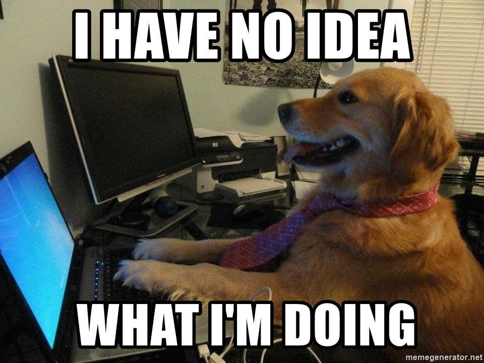

### Step 0: Setup and thoughts

The goal of this project is to <del>impress Musk</del> give enough data to a computer so it can drive a car in Trackmania.

**The very high level steps I'll be taking are:**

- Take a screenshot of the game
- Clean and analyze the screenshot to extract as much data as possible (lanes, speed, time, etc...)
- Feed the data into some sort of IA
- Let the IA output commands to the game
- Build a system to notifiy the IA when the car is stuck (fail) or when the track is finished (success)
- Let it run on it's own for a while and hope it doesn't take over the world

### Step 1: Reading game frames with OpenCV

This is straightforward, I'll just take some screenshots of the game using `ImageGrab` in a loop and then use `OpenCV` to display those images in a window. Simple !

```python
def screen_record():
    while(True):
        printscreen =  np.array(ImageGrab.grab(bbox=(0,40,800,640)))
        cv2.imshow('window',cv2.cvtColor(printscreen, cv2.COLOR_BGR2RGB))
        if cv2.waitKey(25) & 0xFF == ord('q'):
            cv2.destroyAllWindows()
            break

screen_record()
```

### Step 2: Proccessing images using OpenCV

Now that we have images from the game we need to do some image processing to extract as much data as possible from them. Our IA needs to know it's position on the track, thus we need to find the side of the track.

We will be using [OpenCV's Canny function](https://opencv-python-tutroals.readthedocs.io/en/latest/py_tutorials/py_imgproc/py_canny/py_canny.html)

Per the documentation:

> Canny Edge Detection is a popular edge detection algorithm. It was developed by John F. Canny in 1986.

```python
def screen_record():
    while(True):
        printscreen =  np.array(ImageGrab.grab(bbox=(0,40,800,640)))
        processed_img = cv2.cvtColor(printscreen, cv2.COLOR_RGB2GRAY)
        processed_img = cv2.Canny(processed_img, threshold1=200, threshold2=300)
        cv2.imshow('window',processed_img)
        if cv2.waitKey(25) & 0xFF == ord('q'):
            cv2.destroyAllWindows()
            break

screen_record()
```

Exactly what we need as a starting point to detect the lanes on the screen 🎊 ! The Canny Edge detection process consists of 5 steps:

1. Noise reduction
2. Gradient calculation
3. Non-maximum suppression
4. Double threshold
5. Edge Tracking by Hysteresis

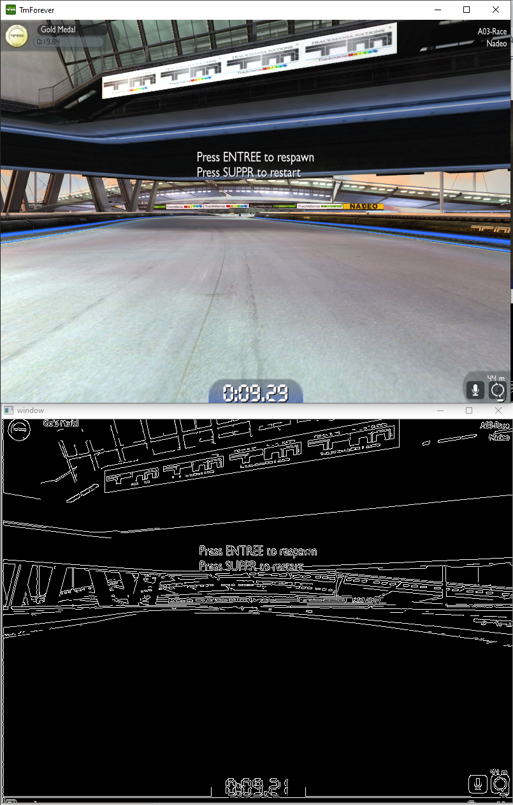

### Step 3: Can we send inputs to the game ?

Before going further, I want to make sure that I'm able to send inputs to the game one way or another.
Using <del>my brain</del> stackoverflow and the answer to the question `Simulate Python keypresses for controlling a game` I was able to cook this little code snippet to "drive" my car from my python script. You're the real MVP [Hodka](https://stackoverflow.com/users/3550306/hodka).

This example uses `0x11` or `W` as the keyboard scancode key.

Thanks to [this](https://gist.github.com/tracend/912308) I adapted it to my use case, using arrow keys on my azerty keyboard like the filthy french I am 😉

I've saved this snippet of code in a file named `presskey.py` after adding the following constants

```python
UP = 0xC8
DOWN = 0xD0
LEFT = 0xCB
RIGHT = 0xCD
```

Here is what my code looks like now

```python
def screen_record():
    while(True):
        printscreen =  np.array(ImageGrab.grab(bbox=(0,40,800,640)))
        processed_img = cv2.cvtColor(printscreen, cv2.COLOR_RGB2GRAY)
        processed_img = cv2.Canny(processed_img, threshold1=200, threshold2=300)
        cv2.imshow('window',processed_img)
        PressKey(UP)
        if cv2.waitKey(25) & 0xFF == ord('q'):
            cv2.destroyAllWindows()
            break

screen_record()
```

And lo and behold, it "works" !

`youtube:https://www.youtube.com/embed/Dw3c1CujKC8`

We now have:

- Image output from Trackmania
- Image processing using openCV
- Simple input sent to Trackmania

This is where the fun begins 😎

### Step 4: Applying a Region Of Interest mask

While googling I found this concept of "region of interest".
It's a simple solution to a common problem, consider this screenshot:

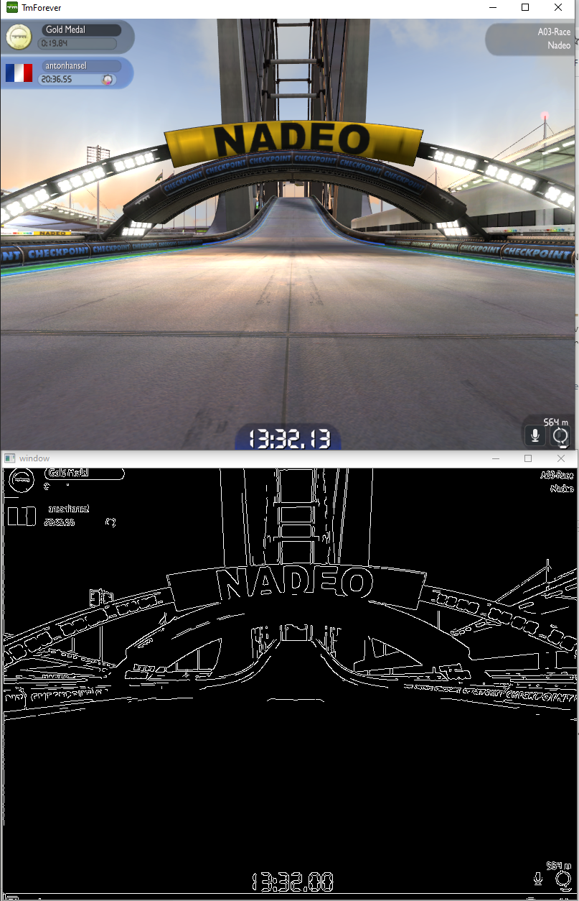

The ouput is polluted by the tracks features such as text on the side, arcs, lights, etc...

The principle of the region of interest is to define a part of the screen where we are going to look for the track edges and ignore the rest and treat it as "noise"

Our window is 600 pixels high and 800 pixels wide, but this is the area we want to work with (⚠️ disclaimer: insane paint skills ahead)

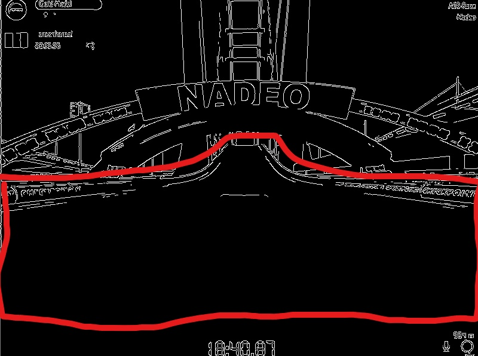

I realise that if we go up or down a road, my ROI (region of interest) will be completely different, but I'm not smart enough to know how to fix that yet, step by step !

Let's define a region of interest "by hand"

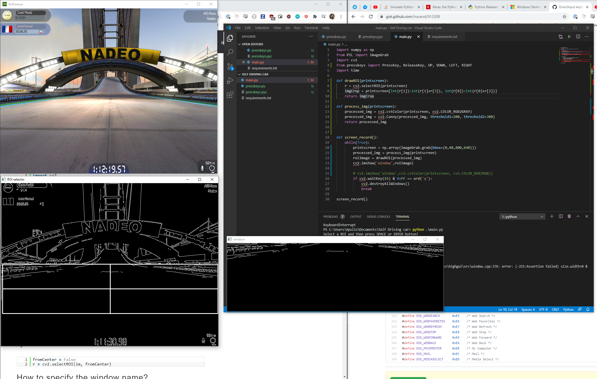

The square's xy values are (0, 293, 800, 261)

My code now looks like this:

```python
def findRoi(printscreen):
    r = cv2.selectROI(printscreen)
    imgCrop = printscreen[int(r[1]):int(r[1]+r[3]), int(r[0]):int(r[0]+r[2])]
    print(r)
    return imgCrop

def process_img(printscreen):
    processed_img = cv2.cvtColor(printscreen, cv2.COLOR_RGB2GRAY)
    processed_img = cv2.Canny(processed_img, threshold1=200, threshold2=300)
    return processed_img

def screen_record():
    while(True):
        printscreen = np.array(ImageGrab.grab(bbox=(0,40,800,640)))
        processed_img = process_img(printscreen)
        roiImage = findRoi(processed_img)
        cv2.imshow('window',roiImage)
        if cv2.waitKey(25) & 0xFF == ord('q'):
            cv2.destroyAllWindows()
            break

screen_record()
```

This gave me coordinates representing a square but what we want is more like a trapezium.

I used [this tool](https://www.mobilefish.com/services/record_mouse_coordinates/record_mouse_coordinates.php) with a screenshot of my game to draw a better shaped ROI


This is my mona lisa, right here.

Here are the coordinates:

```python
[7,300], [321,291], [376,240], [436,239], [524,293], [684,311], [790,313], [795,531], [2,524]
```

It's far from perfect and I'll come back to this later but let's try it anyway!

At this point I realised two things:

- I shouldn't try to play in first person view, it removes the car from the screen, yes, but I have a feeling edges are easier to detect the higher the camera is.
- My edges aren't clear enough, my image input with the Canny filter applied on it is way too noisy

I've read in research papers that edge detection is easily affected by noise in the original image. This noise can be filtered out using a Gaussian Blur that smoothes out the image.

I randomly stumbled upon ["Gaussian-Based Edge-Detection Methods—A Survey"](https://pdfs.semanticscholar.org/4834/ef7df6b94ad2d5ccf5c4714be1f98c54b69e.pdf) and I recommend reading it for more insights about edge detection

Good thing this is 2020 and you can use libraries like OpenCV because I understand english but not math.

I applied this filter, switched back to Third Person View and drew new vertices leaving out the car


Much better

```python
[14,273],[259,219],[496,219],[799,251],[801,496],[677,494],[518,309],[269,311],[134,504],[7,500]
```

Here is a side by side comparison of the Gaussian blur on the Canny edge detection. As you can see on the right, with Gaussian blur enabled, the output is cleaner. Not perfect, by far, but cleaner.

`youtube: https://www.youtube.com/embed/rci4Tukx-sE`

And here it is with the ROI mask applied to it

`youtube: https://www.youtube.com/embed/2LV1EprNKN8`

A couple of notes:

- When going uphill or taking a jump, the mask is hiding a lot of the road
- I'm not sure my output is clean enough, we'll see.

### Step 5: Applying the Hough lines transform algorithm

Again, openCV with the rescue with [great documentation and examples](https://opencv-python-tutroals.readthedocs.io/en/latest/py_tutorials/py_imgproc/py_houghlines/py_houghlines.html)

> Hough Transform is a popular technique to detect any shape, if you can represent that shape in mathematical form. It can detect the shape even if it is broken or distorted a little bit

I'm not going to pretend I understand the whole math principles behind this algorithm but basically the goal is to find the lines in the image.

It’s worth noting that in OpenCV exports the `HoughLines` and the `HoughLinesP` methods. `HoughLinesP` is a probabilistic implementation of the Hough Lines algorithm and ouputs only the extremes of detected lines.

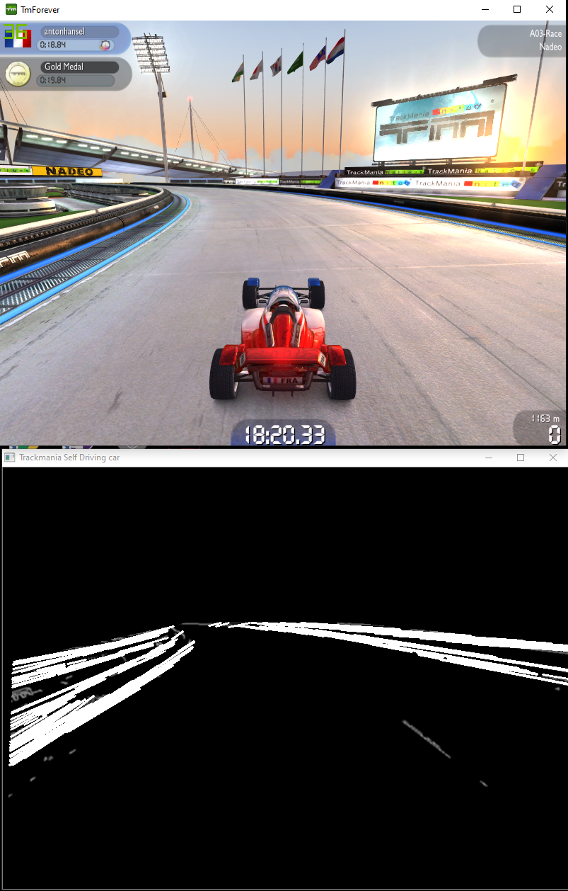

Not bad ! Here is the current code I'm working with, a bit messy but who cares ¯\_(ツ)\_/¯ !

```python
def draw_lines(img):
    lines = cv2.HoughLinesP(img, 1, np.pi/180, 180, np.array([]), 250, 7)
    if lines is not None:
        for line in lines:
            coords = line[0]
            cv2.line(img, (coords[0],coords[1]), (coords[2],coords[3]),(255, 255, 255), 2)
    return

def process_img(printscreen):
    processed_img = cv2.cvtColor(printscreen, cv2.COLOR_RGB2GRAY)
    processed_img = cv2.Canny(processed_img, threshold1=200, threshold2=300)
    gauss_img = cv2.GaussianBlur(processed_img,(5, 5), 0)
    return gauss_img

def roi(img):
    vertices = np.array([[14,273],[259,219],[496,219],[799,251],[801,496],[677,494],[518,309],[269,311],[134,504],[7,500]])
    mask = np.zeros_like(img)
    cv2.fillPoly(mask, [vertices], 255)
    masked_img = cv2.bitwise_and(img, mask)
    return masked_img

def screen_record():
    while(True):
        printscreen = np.array(ImageGrab.grab(bbox=(0,45,800,640)))
        processed_img = process_img(printscreen)
        masked_img = roi(processed_img)
        draw_lines(masked_img)
        cv2.imshow('Trackmania Self Driving car',masked_img)

        if cv2.waitKey(25) & 0xFF == ord('q'):
            cv2.destroyAllWindows()
            break

screen_record()
```

### Step 6: Finding the lanes using our Hough Lines

Ok, this was a tough one, here is the plan I had in mind:

- Group the lines by left and right
- Remove outliers (background elements detected as lines)

Consider this screenshot, heavily edited using the cutting edge software "Paint" ™️

The part of line in the center of the screen `(B)` is higher than the part of the line on the edge of the screen `(A)`. So, `yA < yB and yC > yD`

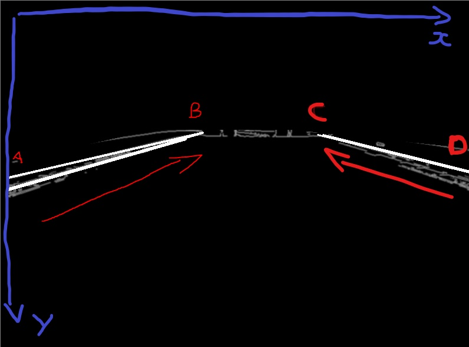

To compute the slope of each line defined by two points with an x and y coordinates, we can do

```python
(yB - yA) / (xB - xA)
```

if the slope is negative, then it's a "left" line, otherwise it's a "right" line !
keep in mind that 0, 0 is on the top left, not bottom left as you are used to. (Wondering why ? Check out this [great answer](https://gamedev.stackexchange.com/questions/83570/why-is-the-origin-in-computer-graphics-coordinates-at-the-top-left) from `Uwe Plonus`)

Here is how these operations translate into code:

```python
def sortSlopes(lines, img):
    startleftx = []
    endleftx = []
    startlefty = []
    endlefty = []
    startrightx = []
    endrightx = []
    startrighty = []
    endrighty = []
    if lines is not None:
        for line in lines:
            coords = line[0]
            if (coords[2] - coords[0]) != 0:  # Avoid division by 0
                slope = (float(coords[3] - coords[1])) / \
                    (float(coords[2] - coords[0]))
                if (slope > 0.15 and slope < 0.5):
                    cv2.line(img, (coords[0], coords[1]),
                             (coords[2], coords[3]), (255, 255, 255), 2)
                    startrightx.extend([coords[0]])
                    endrightx.extend([coords[2]])
                    startrighty.extend([coords[1]])
                    endrighty.extend([coords[3]])
                    print "Slope Right: " + str(slope)
                elif (slope < -0.15 and slope > -0.5):
                    cv2.line(img, (coords[0], coords[1]),
                             (coords[2], coords[3]), (255, 255, 255), 2)
                    startleftx.extend([coords[0]])
                    endleftx.extend([coords[2]])
                    startlefty.extend([coords[1]])
                    endlefty.extend([coords[3]])
                    print "Slope Left: " + str(slope)
                else:
                    print "Non extreme slope: " + str(slope)
    return startleftx, endleftx, startlefty, endlefty, startrightx, endrightx, startrighty, endrighty
```

I couldn't wait and I built a "driving algorithm": If there are tons of lines on the right, go left, otherwise, go right, and always go forward.

Here is the result !

`youtube: https://www.youtube.com/embed/Dw3c1CujKC8`

### Bonus: Improving of the ROI

I'm aware that my ROI, image processing and line sorting algorithm are subpar. Before going further, I'm going to fine tune this and try to get the best data possible for my IA.

First, the ROI function. I extrapolated from messy coordinates I previously had a cleaner and symmetrical array of vertices

```jsx
def roi(img):
    vertices = np.array([[0, HEIGHT * 0.455], [WIDTH / 3, HEIGHT * 0.365], [WIDTH * 0.62, HEIGHT * 0.365], [WIDTH - 1, HEIGHT * 0.41], [WIDTH - 1, HEIGHT * 0.82], [
                        WIDTH * 0.84, HEIGHT * 0.83], [WIDTH * 0.64, HEIGHT / 2], [WIDTH / 3, HEIGHT / 2], [WIDTH * 0.16, HEIGHT * 0.83], [0, HEIGHT * 0.83]], dtype=np.int32)
    mask = np.zeros_like(img)
    cv2.fillPoly(mask, [vertices], 255)
    masked_img = cv2.bitwise_and(img, mask)
    return masked_img
```

### Step 7: Finding and drawing the lanes using the hough lines

The hough lines are... just lines.
We need to find the lanes of the track by coumpounding the lines. Sort them left and right, draw the extremes and then draw the resulting lanes!

```jsx
def drawLanes(startleftx, endleftx, startlefty, endlefty, startrightx, endrightx, startrighty, endrighty, img):
    if len(startleftx) > 0 and len(startlefty) > 0:
        avgStartLeftX = average(startleftx)
        avgStartLeftY = average(startlefty)

        avgEndLeftX = average(endleftx)
        avgEndLeftY = average(endlefty)

        cv2.line(img, (avgStartLeftX, avgStartLeftY),
                 (avgEndLeftX, avgEndLeftY), (0, 255, 0), 2)

    if len(startrightx) > 0 and len(startrighty) > 0:
        avgStartRightX = average(startrightx)
        avgStartRightY = average(startrighty)

        avgEndRightX = average(endrightx)
        avgEndRightY = average(endrighty)

        cv2.line(img, (avgStartRightX, avgStartRightY),
                 (avgEndRightX, avgEndRightY), (255, 0, 0), 2)
```

### Step 8: Reading car data from the screen

This should be straightforward OCR stuff with a twist: I've done that before while <del>building data crawlers on image databases</del> doing perfectly legit stuff but we need to be near real time on this particular project.

Edit: I was so wrong, this was by far the most difficult step for me, never ever believe anything I say

I watched this awesome talk by Franck Chastagnol about building an image processing pipeline in python and it helped me a lot undertand the very basics

`youtube: https://www.youtube.com/embed/B1d9dpqBDVA`

The data we need to extract are the distance traveled and the current speed.

This information is displayed on the screen, always at the same place, no memory manipulation or ROI shenanigans required here.

First, the image needs to be cropped around the text areas

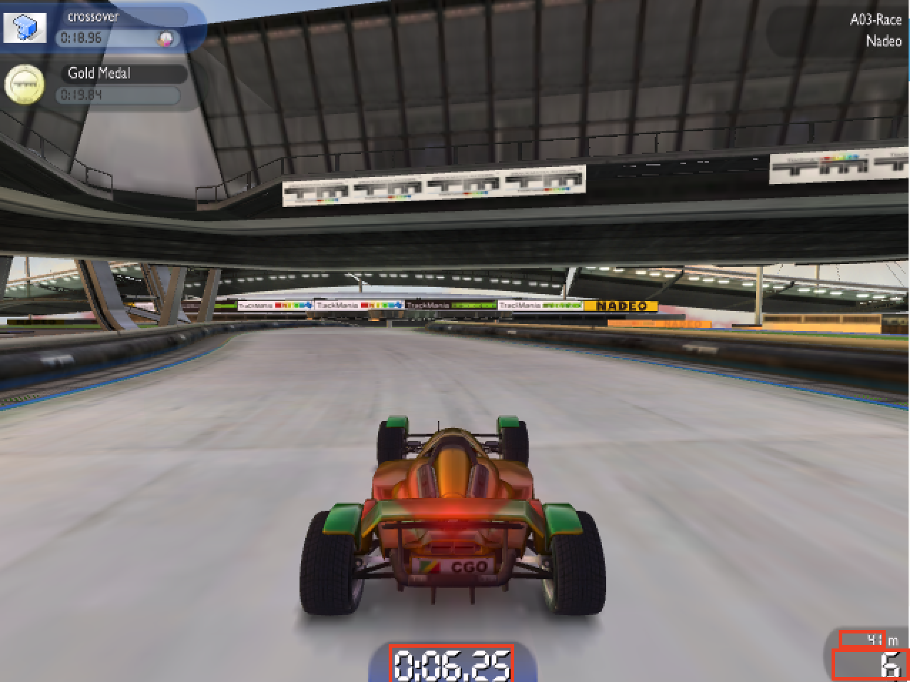

```python
def getMetaData(img):
    # Get image dimensions
    dimensions = img.shape
    height = img.shape[0]
    width = img.shape[1]

    # Speed is at the bottom right, easy to grab
    speedImg = img[int(height - (height * 0.05)):int(height),
                   int(width - (width * 0.07)): int(width)].copy()

    # Distance is at the bottom right, right above the speed, we just need to add some padding here
    distanceHeightMultiplier = 0.05
    distanceWidthMultiplier = 0.015
    distanceImg = img[int(height - (height * (0.03 + distanceHeightMultiplier))):int(int(height - (height * distanceHeightMultiplier))),
                      int(width - (width * (0.045 + distanceWidthMultiplier))): int(width - (width * distanceWidthMultiplier))].copy()

    # Time is in the middle part of the screen at the bottom, roughly the same height as the speed
    timeWidthMultiplier = 0.08
    timeImg = img[int(height - (height * 0.07)):int(height),
                  int(width - (width * (0.5 + timeWidthMultiplier))): int(width - (width * (0.5 - timeWidthMultiplier)))].copy()
```

And the result:

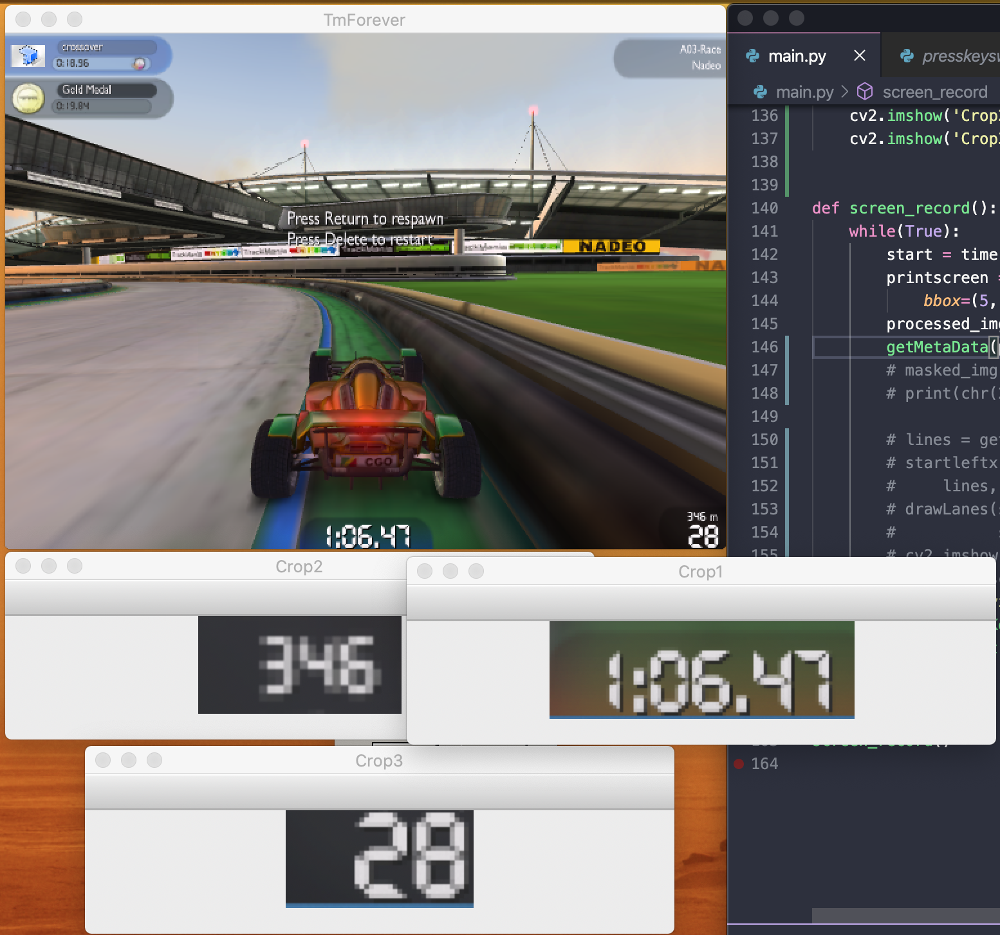

Now to data extraction. For this I will use pytesseract. Installing it on windows is a bit tricky, [follow this tutorial](https://stackoverflow.com/questions/50951955/pytesseract-tesseractnotfound-error-tesseract-is-not-installed-or-its-not-i)

First, I need to work a bit on the cropped image to make them OCR friendly. To do so, I need to convert the images to grayscale and then apply binary thresholding.
Binary thresholding is straightforward, it turns every pixel either completely black or white.

[Explications threshold et BGR2GRAY [https://techtutorialsx.com/2019/04/13/python-opencv-converting-image-to-black-and-white/](https://techtutorialsx.com/2019/04/13/python-opencv-converting-image-to-black-and-white/)]

The speedometer looks very sharp en readable now.

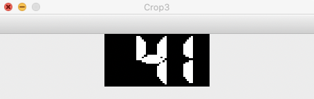

I encountered an issue with PyTesseract by this point, regular text and numbers can be read out of the box but it seems that the font used by Trackmania is unsupported.
The display used is a 7 segment display

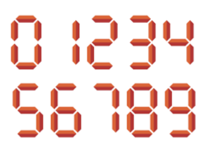

After some googling I found [this pretrained model](https://github.com/arturaugusto/display_ocr/tree/master/letsgodigital) for Tesseract by Artur Augusto to read 7 segment displays

My first attempts were flaky at best, with `1` being consistently read as `6` or `9` for some reason

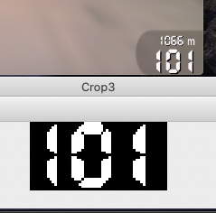

```python
Analyzed 1 frame in 0.753118991852
Speed: 609 # Go home pytesseract, you're drunk
```

After tweaking my input for a while with no success, I finnaly settled on another trained dataset found on [this github issue](https://github.com/Shreeshrii/tessdata_ssd/issues/1) and I heavily processed my input image to make it suitable for reading.

Here is the final commented code snippet to extract speed and distance from the screenshot

```python
def getData(test, lowerThresh, blur):
    # First add some gaussian blur to make the gap between the numbers smaller
    test = cv2.GaussianBlur(test, (blur, blur), 0)
    # Then convert the image to grayscale
    test = cv2.cvtColor(test, cv2.COLOR_BGR2GRAY)
    # Use threshold to turn the image in black and white mode
    (thresh, test) = cv2.threshold(
        test, lowerThresh, 255, cv2.THRESH_BINARY)
    #Finally invert the colors on the image since it appears that Tesseract is way better at reading black text on white background
    test = (255-test)
    cv2.imshow('Crop3', test)
    return pytesseract.image_to_string(test, lang="7seg", config="--psm 13 -c tessedit_char_whitelist=\"0123456789\" --tessdata-dir \"" + os.path.dirname(os.path.abspath(__file__)) + "\letsgodigital\"")

def getMetaData(img):
    # Get image dimensions
    height = img.shape[0]
    width = img.shape[1]

    # Speed is at the bottom right, easy to grab
    speedImg = img[int(height - (height * 0.05)):int(height),
                   int(width - (width * 0.08)): int(width)].copy()

    # Distance is at the bottom right, right above the speed, we just need to add some padding here
    distanceHeightMultiplier = 0.05
    distanceWidthMultiplier = 0.015
    distanceImg = img[int(height - (height * (0.03 + distanceHeightMultiplier))):int(int(height - (height * distanceHeightMultiplier))),
                      int(width - (width * (0.045 + distanceWidthMultiplier))): int(width - (width * distanceWidthMultiplier))].copy()

    speed = getData(speedImg, 150, 5)
    speed = re.sub("\D", "", speed)
    distance = getData(distanceImg, 170, 1)
    distance = re.sub("\D", "", distance)

    return speed, distance
```

And that's it ! We now have all the inputs we need to give ou IA to drive all the way to the finish line !

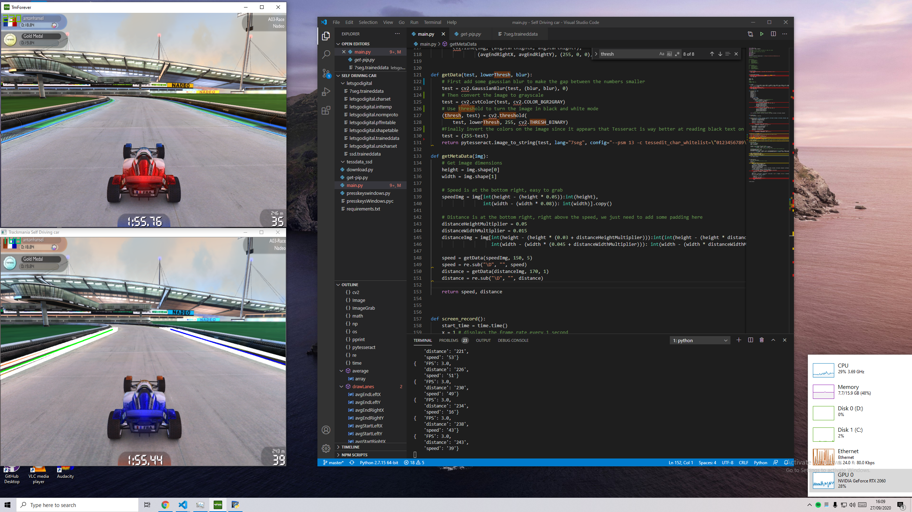

In the next article, we will be putting some actual intelligence in our experiment 🚀

**Thanks**

Big thanks to [https://twitter.com/sentdex](https://twitter.com/sentdex) from pythonprogramming for awesome openCV and python tutorials, campus hippo for very useful code snippets and [Matt Hardwick](https://twitter.com/MRHwick) for his work on Self driving cars.
